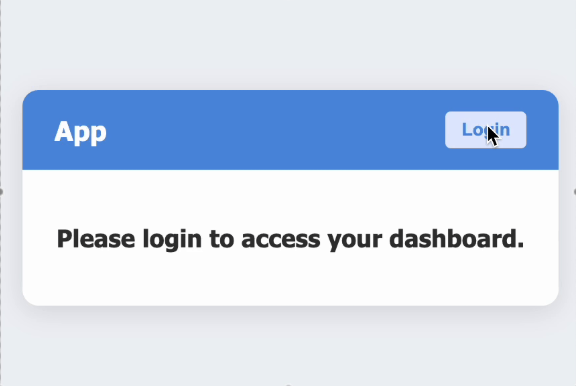

# React Context API Authentication System

Build a simple user authentication system using React Context API. The goal is to understand how to create context, provide context, and consume context within components, as well as manage basic authentication state globally.



https://namastedev.com/practice/authentication

---

## Requirements

### 1. UserContext

Create a `UserContext` using:

```js
React.createContext();
```

Store the following in the context:

- `isLoggedIn`
  - A boolean that is `false` by default.
  - Toggles between `true` and `false` using login/logout functions.

- `login()`
  - Function to log in a user.

- `logout()`
  - Function to log out the user.

---

### 2. App

- Wrap the application with `UserProvider`.

---

### 3. Navbar Component

The Navbar component should:

- Display the app title (`App`) in the navigation bar.
- Use `UserContext` to access:
  - `isLoggedIn`
  - `login`
  - `logout`

#### If the user is NOT logged in:

- Show a `"Login"` button.
- Clicking the button should trigger the `login()` function.

#### If the user IS logged in:

- Display the message:

```txt
Welcome, User!
```

- Show a `"Logout"` button.
- Clicking the button should trigger the `logout()` function.

---

### 4. Dashboard Component

Use `UserContext` to access the `isLoggedIn` state.

#### If the user is NOT logged in:

Display the message:

```txt
Please login to access your dashboard
```

#### If the user IS logged in:

Display the message:

```txt
This is your dashboard
```

---

## Suggested File Structure

```txt
src/
│
├── context/
│   └── UserContext.jsx
│
├── components/
│   ├── Navbar.jsx
│   └── Dashboard.jsx
│
├── App.jsx
└── main.jsx
```

---

## Concepts Practiced

- React Context API
- Global state management
- `createContext`
- `useContext`
- Context Provider pattern
- Conditional rendering
- Authentication state handling

---

## Example Flow

### Initial State

```txt
Navbar:
[ App ] [ Login ]

Dashboard:
Please login to access your dashboard
```

### After Clicking Login

```txt
Navbar:
[ App ] Welcome, User! [ Logout ]

Dashboard:
This is your dashboard
```

---

## Testing Instructions

- Verify the app starts with `isLoggedIn = false`
- Verify clicking Login updates the UI
- Verify clicking Logout updates the UI
- Verify Dashboard changes based on authentication state
- Verify Navbar conditionally renders buttons/messages correctly
